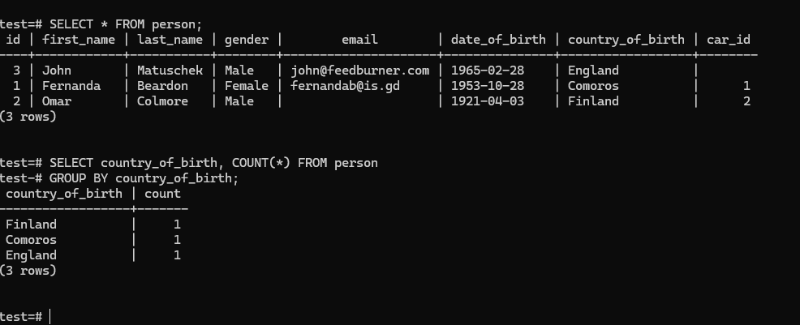

# POSTGRESQL REFERENCE


I have created this reference document to help me reference or recall commands I have learnt and avoid many google searches for the command I want.Please note that this list only reflect on commands that I have learnt and does not exhaust all the commands.It can also serve as a starting point for anyone who wants to learn about PostgreSQL but do not know where to begin.Hope this helps.

# Prerequisites

You need to have POSTGRESQL installed on your system.

#### Installation on windows

https://www.youtube.com/watch?v=GpqJzWCcQXY

#### Installation on linux

https://www.youtube.com/watch?v=cD32EHVWRXY

#### Installation on mac

https://www.youtube.com/watch?v=a78hxM4-99A

After successful installation you can then run these commands in the psql command line.
<br>

# Commands

### CREATE A DATABASE

#### Command Syntax

```sql
CREATE DATABASE [database_name]
```

#### Example

```sql
CREATE DATABASE demo_db
```

<br>

### DROP A DATABASE

#### Command Syntax

```sql
DROP DATABASE [database_name]
```

#### Example

```sql
DROP DATABASE demo_db
```

**_NB: This command is dangerous to use especially in production.It results in permanent deletion of data and if there is no backup of said data,it will be lost forever._**

<br>

### CREATE A TABLE IN A DATABASE

#### Command Syntax

```sql
CREATE TABLE [table_name](
    Column name + data type + constraints
)
```

#### Example

```sql
CREATE TABLE product(
    id BIGSERIAL NOT NULL PRIMARY KEY,
    product_name VARCHAR(50) NOT NULL,
    product_desc VARCHAR(100) NOT NULL,
    product_price NUMERIC NOT NULL
)
```

#### Explanation

- We are creating a table called product.
- The table will hold data with columns: id, product_name, product_desc, product_price
- We also attached data types to the respective columns: id, product_name, product_desc, product_price
- We also attached constraints to the columns: NOT NULL, PRIMARY KEY
- Constraint is just a rule enforces to a column or table.This improves data reliability, accuracy and integrity.
- In the above example we are saying: id cannot be null and it is also a primary key.

<br>

### DROP A TABLE IN A DATABASE

#### Command Syntax

```sql
DROP DATABASE [table_name]
```

#### Example

```sql
DROP DATABASE product
```

**_NB: This command is dangerous to use especially in production.It results in permanent deletion of data and if there is no backup of said data,it will be lost forever._**

<br>

### INSERTION OF A RECORD IN A DATABASE

#### Command Syntax

```sql
INSERT INTO TABLE [database_name](column 1, column 2)
VALUES(value1, value2);
```

#### Example

```sql
INSERT INTO product(product_name, product_desc, product_price)
VALUES('Carrots', 'Carrots Desc', 10.00);
```

#### Explanation

- We are inserting a row in our product table.
- We specified the columns that we are populating with data in that table e.g product_name, product_desc, product_price.
- You noticed that we did not add id to the row and this is because it is auto incremented by the database.

<br>

### SELECT Command

#### Command Syntax

```sql
Select * FROM [table_name];
```

#### Example

```sql
SELECT * FROM product;
```

#### Explanation

- We are selecting all (\*) columns in the database and return the records

We can also specify the columns that we want to return as follows:

```sql
SELECT product_name, product_price FROM product;
```

This only returns rows with the columns product_name and product_price.

Note that these commands returns all the records in that specified table

<br>

### ORDERING

- Ordering can be by ascending order or descending order
- By default the ordering is in ascending order.

#### Command Syntax

```sql
SELECT * FROM [table_name] ORDER BY [column_name];
```

- We are selecting all the columns and returning all the rows in the table.
- The returned records are beign ordered by column_name in ascending order.

#### Example

```sql
SELECT * FROM product ORDER BY product_price;
```

- Here we are saying select all columns in every row in the product table and return them.
- But before you return them order them by product_price in ascending order.

#### Example 2

```sql
SELECT product_name, product_price FROM product ORDER BY product_price DESC;
```

- Here we are selecting columns: product_name and product_price from the product table rows and order them by product_price in descending order.

**_NB:Note the if we do not specify the ordering type in is going to be in Ascending Order (ASC) and Descending order is denoted by DESC_**

<br>

### DISTINCT

- This command is used to return unique values found for specific table column e.g in a table we can have 50 rows with different gender(20 males, 20 female, 10 rather not say).
- This commands only return 3 values (male, female, rather not say).

#### Command Syntax

```sql
SELECT DISTINCT [column_name] FROM [table_name] ORDER BY [column_name];
```

#### Example

```sql
SELECT DISTINCT product_price FROM product ORDER BY product_price;
```

- We are selecting unique prices from the product table and then order them by product_price in ascending order;

<br>

### Comparison Operators

- Used to compare values
- Returns true or false on operations

```
y = x -> Equal
x < y -> Less than
x > y -> Greater than
x <= y -> Less than or equal to
x >= y -> Greater than or equal to
x <> y -> Not equal to
```

### WHERE , AND , OR Clause

- These commands are used to filter records using specified conditions

#### Command Syntax

```sql
SELECT * FROM [table_name] WHERE  [specified_condition] ;
```

#### Example

```sql
SELECT * FROM product WHERE product_price > 3.00 AND expiration_date = '2026-02-10'
```

#### Example 2

```sql
SELECT * FROM product WHERE product_price > 3.00 OR product_price = 3.50;
```

<br>

### LIMIT,OFFSET,FETCH Commands

```
LIMIT - is used to specify the number of records to return.
FETCH - works the same way as LIMIT but FETCH is the SQL standard.
OFFSET - SPECIFY to return elements after a certain number.
```

#### LIMIT

```sql
SELECT * FROM product LIMIT 10;
```

- Returning only 10 records from the product table;

#### FETCH

```sql
SELECT * FROM product FETCH FIRST 10;
```

- Returning only 10 records from the product table;
- You can also use LAST command to return the LAST 10 values;
- [More info](https://www.postgresql.org/docs/current/sql-fetch.html) on FETCH.

#### OFFSET

```sql
SELECT * FROM product OFFSET 5;
```

- Return all records after the fifth record

### IN Command

- Allows you to return records that matches on of the values you have specified
- Treat it like a chain of OR statements but easier to read.

```sql
SELECT * from users WHERE user_role IN('admin', 'editor');
```

- This commands returns users with a user_role which is admin OR editor only;

<br>

### BETWEEN

- IT is used to fetch records between specified parameters

#### Command Syntax

```sql
SELECT * FROM person
WHERE date_of_birth
BETWEEN 'date1' AND 'date2';
```

#### Example

```sql
SELECT * FROM person
WHERE date_of_birth
BETWEEN '2000-01-01' AND '2026-01-01';
```

<br>

### LIKE and iLIKE Commands

```
Like command is used to match a specified pattern
iLIKE command
```

#### Example 1

```sql
SELECT * FROM person WHERE email LIKE '%gmail.com';
```

- This commands returns records that have email addresses that ends with **_gmail.com_**

#### Example 2

```sql
SELECT * FROM product WHERE product_name LIKE 'Pespi%';
```

- This returns all the products that starts with **_Pepsi_**

#### Example 3

```postgres
SELECT * FROM product WHERE product_name iLIKE 'Pespi%';
```

- iLIKE commands makes the pattern case insensitive e.g it can make pepsi,Pepsi,PEPSI,etc

#### Example 4

```postgres
SELECT * FROM product WHERE product_name iLIKE '_Pespi%';
```

- the underscore in **_\_Pespsi%_** allows you to match a single character before pepsi
- It can match strings like "zPespi", "ePepsi", etc

<br>

### GROUP BY

- This command allows us to group records that share same value in a column or columns

#### Example 1

```sql
SELECT country_of_birth, COUNT(*) FROM person GROUP BY country_of_birth;
```

- We are selecting column country_of_birth and grouping records by country_of_birth and get a count of all these records.
  
